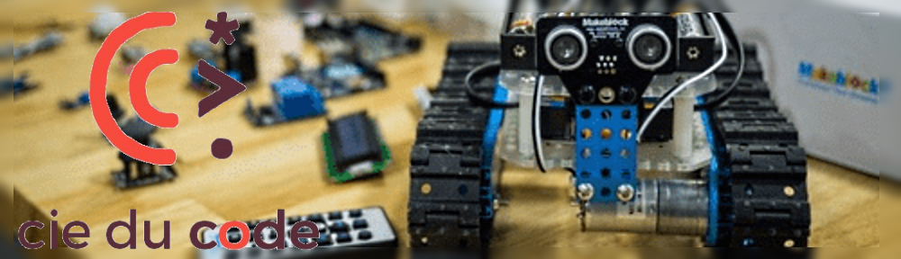
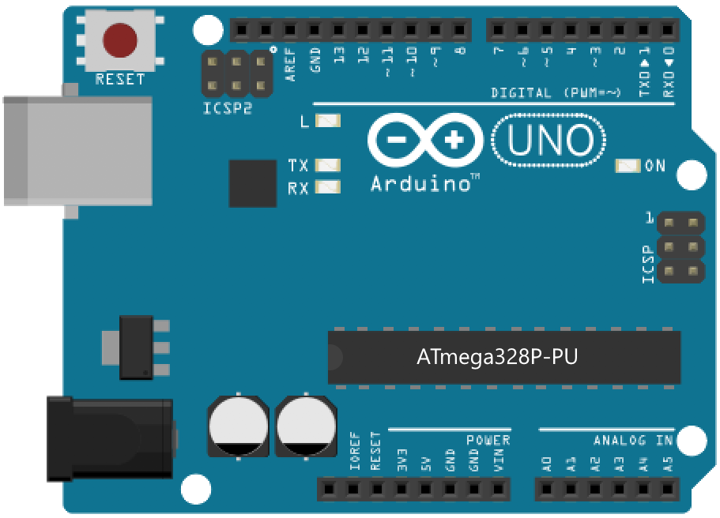
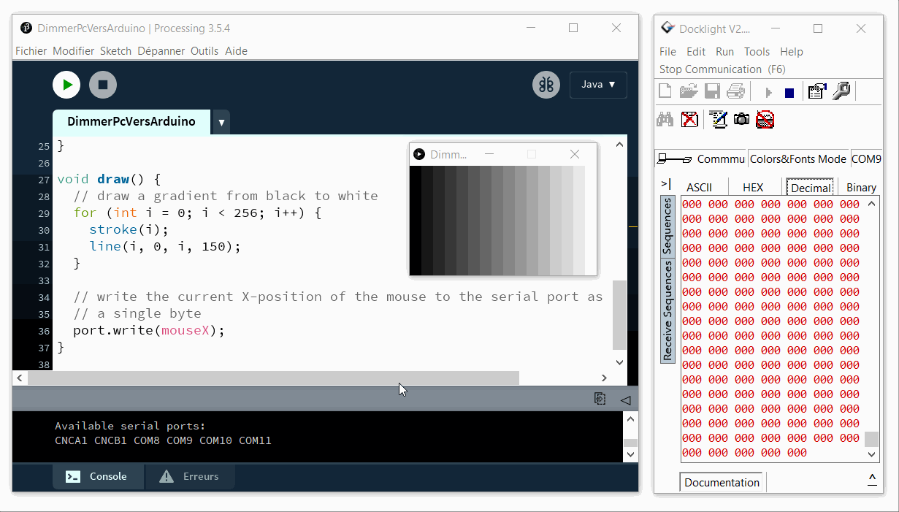
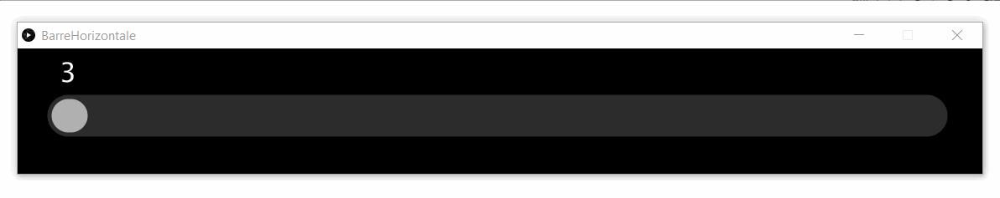

# Stage Electronique et Robotique



Lors du stage de programmation sur le thême _électronique et robotique_ organisé par "**_[La Compagnie du Code](https://www.lacompagnieducode.org/)_**", nous avons entre autres découvert comment faire communiquer la carte Arduino avec l'ordinateur.

Vous retrouverez ici les exemples des programmes [Processing](https://processing.org/) en Java, ainsi que le [code Arduino](Arduino/AnalogReadSerial/AnalogReadSerial.ino) en C++ traduit pour vous en français :


- [Réaliser un programme sur ordinateur qui interagit avec la carte Arduino](#réaliser-un-programme-sur-ordinateur-qui-interagit-avec-la-carte-arduino)
  - [Du PC vers Arduino](#du-pc-vers-arduino)
  - [De la carte Arduino au PC](#de-la-carte-arduino-au-pc)
    - [Premier pas, décodage de la valeur transmise par Arduino](#premier-pas-décodage-de-la-valeur-transmise-par-arduino)
    - [Animez un graphique](#animez-un-graphique)
- [Liens Internet](#liens-internet)

<br/>

---

## Réaliser un programme sur ordinateur qui interagit avec la carte Arduino

Pour cela vous aurez besoin de télécharger le logiciel [Processing](https://processing.org/download/), ainsi que l'IDE [Arduino](https://www.arduino.cc/en/software).

<br/>

---

### Du PC vers Arduino

Dans l'exemple [Dimmer](https://www.arduino.cc/en/Tutorial/BuiltInExamples/Dimmer), le PC envoie un nombre compris entre 0 et 255.

La carte Arduino récupère cette valeur, puis l'utilise pour faire varier l'intensité lumineuse de la LED branchée à une sortie PWM.

Vous aurez besoin des matériaux suivants :

|                  La carte Arduino Uno                  |                      une LED                      |              une résistance<br>ici 220 ohms             |
|:------------------------------------------------------:|:-------------------------------------------------:|:-------------------------------------------------------:|
|  |  |  |

<br/>

Pour tester ce code, il suffit de programmer la carte Arduino et de programmer le PC avec [le code Processing](Processing/DimmerPcVersArduino/DimmerPcVersArduino.pde) qui se trouve dans le même fichier Arduino `Dimmer.ino` entre les lignes 46 et 82, un simple copier/coller dans l'environnement Processing et c'est partie ;-)



Voir également :

* [U=RI | Qu'est-ce que la PWM?](https://www.youtube.com/watch?v=CSReyYwbGRY&ab_channel=U%EA%9E%8ARI)
* [Principe du signal PWM avec l'arduino](https://www.youtube.com/watch?v=U4Xt0-pDYhc&ab_channel=electrotoile)

---

<br/>

### De la carte Arduino au PC

Programmez ensuite votre carte [Arduino Uno](https://store.arduino.cc/arduino-uno-rev3) avec le microprogramme (Firmware en anglais) : [Exemples > 01.Basics > AnalogReadSerial](https://www.arduino.cc/en/Tutorial/BuiltInExamples/AnalogReadSerial)

#### Premier pas, décodage de la valeur transmise par Arduino

Le plus difficile est de comprendre **[Les variables](https://fr.flossmanuals.net/processing/les-variables/)** et comment les convertir dans le bon format pour pouvoir les utiliser...

Un premier programme Processing vous permettra de décortiquer un message reçu par le PC depuis la carte Arduino, voir **[ReceptionValeurEntiere](Processing/ReceptionValeurEntiere/ReceptionValeurEntiere.pde)** et ce qu'il faut en retenir si l'on reçoit la chaîne [ASCII](https://fr.wikipedia.org/wiki/American_Standard_Code_for_Information_Interchange) suivante :

| Caractère reçu  |   1  |   2  |   3  |   4  |   5  |   6  |
|:----------------|:----:|:----:|:----:|:----:|:----:|:----:|
| Type char       |  '1' |  '0' |  '2' |  '3' | '\r' | '\n' |
| Valeur décimale |  49  |  48  |  50  |  51  |  13  |  10  |
| Valeur en Hexa  | 0x31 | 0x30 | 0x32 | 0x33 | 0x0D | 0x0A |

```java
/*
  Voici ce que ce programme affichera si la carte Arduino envoie au PC la chaîne "1023\r\n"

 =====================
 recu: 1023

Affichage de chaque valeur recu:
 [0] '1' = 49
 [1] '0' = 48
 [2] '2' = 50
 [3] '3' = 51
 [4] ''  = 13 ('\r' = CR, Carriage Return: retour chariot)
 [5] '
 '       = 10 ('\n' = LF, Line Feed: saut de ligne)

 nombre converti en un entier: 1023
 */

import processing.serial.*;

// Créer un objet à partir de la classe Serial
Serial mon_port_serie;  // créer un objet de la classe Serial pour la communication sur le port série

void setup() {
  // Modifiez ici le numéro du port COM de votre carte Arduino (depuis les touches [Windows] + [R]: devmgmt.msc)
  mon_port_serie = new Serial(this, "COM3", 9600); // classe d'envoi et de réception de données via le protocole de communication série <https://processing.org/reference/libraries/serial/index.html>

  size(200, 130); // taille de la fenêtre avec width = largeur et height = hauteur
  textSize(32); // définit la taille actuelle de la police de caractère dans la fenêtre graphique <https://processing.org/reference/textSize_.html>
}

void draw() {
  // Si des données sont disponibles sur le port série :
  if (mon_port_serie.available() > 0) {
    String message_recu_en_ascii = mon_port_serie.readStringUntil('\n'); // lisez-le et stockez-le dans val <https://processing.org/reference/libraries/serial/Serial_readStringUntil_.html>

    // Renouvellement de la couleur de l'arrière-plan de la fenêtre, permet d'effacer son contenu ;-) 
    background(0); // définit la couleur utilisée pour l'arrière-plan de la fenêtre, 0 = noir et 255 <https://processing.org/reference/background_.html>

    /* Debut analyse des données reçues : */
    println(); // faire un saut de ligne
    println("====================="); // ligne de séparation de chaque message reçu (ou trame)
    print("recu: ");
    println(message_recu_en_ascii);

    // Déclare un tableau de type char qui contient notre chaîne pour décomposition
    char[] decomposition_de_la_chaine = message_recu_en_ascii.toCharArray(); // notre chaîne converti en un tableau de caractère
    println(decomposition_de_la_chaine);

    println("soit en valeur decimale:");
    for (int i = 0; i < decomposition_de_la_chaine.length; i = i+1) {
      int valeur_numerique_du_caractere = decomposition_de_la_chaine[i];
      println(valeur_numerique_du_caractere);
    }
    /* Fin de l'analyse des données reçues */

    int nombre_entier = Integer.parseInt(trim(message_recu_en_ascii)); // enlever les espaces en début et fin de String, ainsi que les caractères spéciaux '\r' '\n'
    print("nombre entier: ");
    println(nombre_entier);

    text(nombre_entier, 60, 70); // affichage de la valeur numérique dans la fenêtre graphique
  }
}

```

<HR size=1 align=center width="70%">

#### Animez un graphique

En se servant des éléments trouvés dans l'exemple "[Arm](https://processing.org/examples/arm.html)", nous allons pouvoir animer des graphismes selon notre imagination ;-)

Démo de l'affichage d'une [barre horizontale](Processing/BarreHorizontale/BarreHorizontale.pde) :



---

## Liens Internet

* Visionnez la vidéo [Processing et Arduino en français](https://www.youtube.com/watch?v=S3HpkjcoqCM&ab_channel=PlaisirArduino) (10 min 52 sec)
* [Convertisseur ASCII](https://www.dcode.fr/code-ascii)
* [Codage des nombres](https://fr.wikibooks.org/wiki/Fonctionnement_d%27un_ordinateur/Codage_des_nombres)
* [Les tags définis par javadoc](https://www.jmdoudoux.fr/java/dej/chap-javadoc.htm)
